# ***LOGBOOK***

## --> 01/10/2021

## **Link to the presentation**

- Presentation of the thesis at the reasearch group:
  - <https://docs.google.com/presentation/d/15ElxQTOWF413CEzKa1X-jkytDLCtqlsn4-r6IHI-xv8/edit#slide=id.gf080f14cc4_0_6>

## **Done**

- Find the source code of the network discussed in the reference paper
- Start to record sound from acoustic guitar with piezo pickup simultaneously with a SM57 mic using a Roland audio interface
- Start learning the basics of pytorch framework in order to have a better comprehension of the paper code and start writing my own
- Read correlated paper on how organize the dataset

## **Problems encountered**

- Learning the Pytorch framework takes a lot of time
- Training the network takes a lot of computational power
- I haven’t plan well how the dataset will be structured

## **Next steps**

- Continue to record guitar samples for the construction of the dataset
- Continue to experiment with the Pytorch framework
- Start to build a new network from scratch, having as a reference the RNN network in the paper code
- Start working full time on the thesis (certainly from 15 October)

## ***CONTENT***

## *Network*

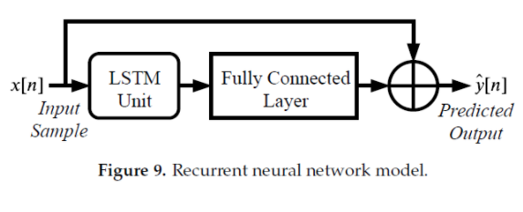

- Input size: 1
- LSTM layer: 32|64|96 hidden size
- Fully Connected layer : 1 neuron
- Output size: 1
- Residual connection
- Adam optimizer

## *Dataset*

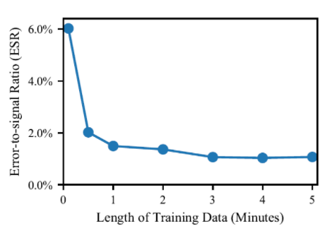

The image is taken from the reference paper, we can try to structure our dataset as:

- Short guitar samples (less than 1 min)
- Concatenate samples to reach more than 3 min for the training data
- Different style of guitar playing
- Different guitars
- Different microphones

## --> OCTOBER 2021

## **Link to the presentations**

- 04/10/2021 -->28/10/2021
  - <https://docs.google.com/presentation/d/1JEnwVpFatTIpygRyNFb8jgqm-Rnqdj4jSRUfyQcTo7Y/edit#slide=id.gf080f14cc4_0_6>
- 29/10/2021:
  - <https://docs.google.com/presentation/d/1C420WwMMnPQDSc4_IOPOUJxso8gSTa_J35J1HSbVtzw/edit#slide=id.gef9b1274ad_0_465>

## **Done**

- understand how works the loss function of the reference paper and see if it's meaningful for our purpose
- start to write the first model of the network
- record the first audio for the dataset
- understand the real-time application of the code
- update the bibliography
- design the filters for the loss function
- start calculationg the loss function in matlab
- plot and testing the loss function
- evaluate the loss function with the "fake" signal:
  - signal + filtered white noise  
  - signal + sinusoids
- study the spectrograms of the input and target
- find a smoothing algorithm for the input signal to resolve the problem of the energy at the high frequencies in the input
- write the loss function in python
- write the low and high pass filters in python
- test on the loss function

## ***DATASET***

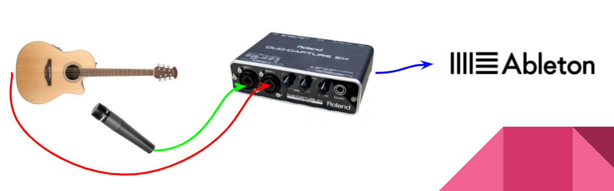

Guitar has been recorded with piezo and SM57 microphone simultaneously.
The signals pass through a Roland audio interface with sample frequency of 44.1 kHz, the output is fed into Ableton and extracted as a mono audio track

## ***STUDY OF THE SIGNALS***

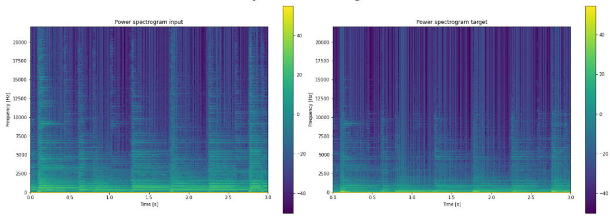

- Input has way more power in the upper register  → smoothing algorithm

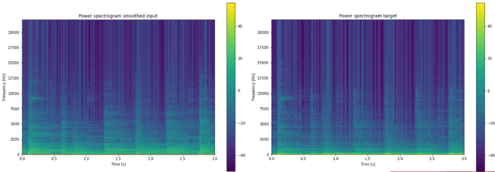

Here is the difference btw the target sound and smoothed input:

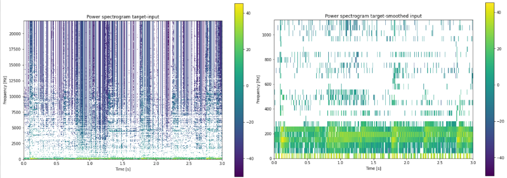

As we can se the major differences between the two signals are in the low frequencies, so we thought to apply a low pass filter on the smoothed input signal.

## ***LOSS FUNCTION***

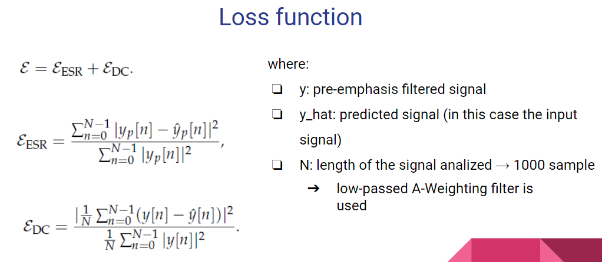

These are the filters used:

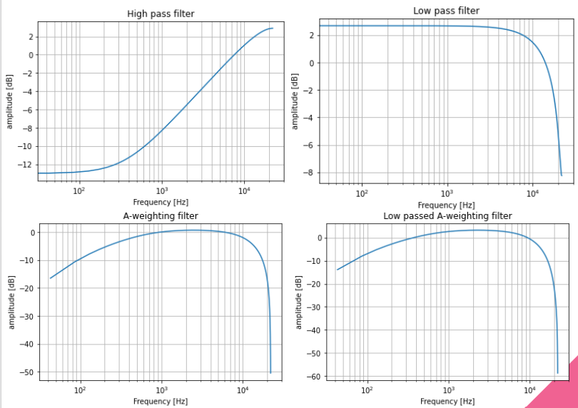

The aim of the test performed on the loss function is to see if the loss used in the reference paper suits also our purpose. We take the recoded audio and calculate the loss of different segments, we also create a "fake" signal summing sinusoids at different frequencies to see if the loss function will decrease in a sort of "network process simulation".

Fake signals:

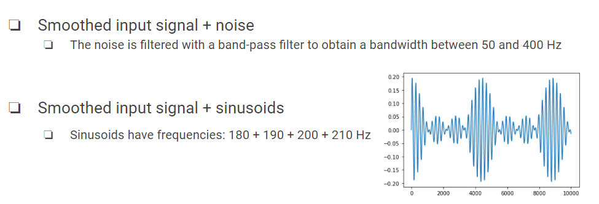

Inputs of the loss function:

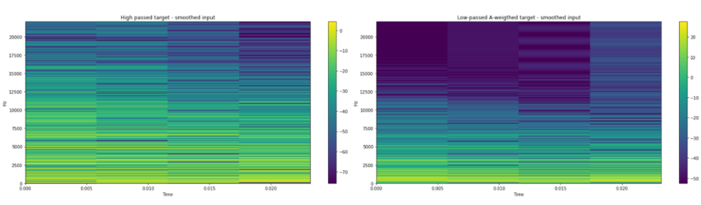

Here we can observe the results of the loss function for a single frame:

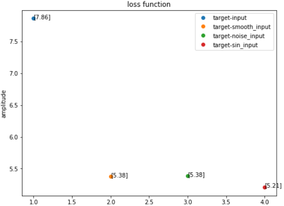

As we can see with the smoothing process the loss value seems to decrease significantly, we can also notice that also the "fake sinusoidal signal" seems to perform better than the smoothed one.

## --> NOVEMBER 2021

## *Link to the presentations*

- 05/11/2021:
  - <https://docs.google.com/presentation/d/1wFjhghcgC8WfFZKi5QvnKG64pVL0mmSeLV8nIN9kv18/edit#slide=id.gf080f14cc4_0_6>
- 08/11/2021:
  - <https://docs.google.com/presentation/d/1ZuAIcYuj4taZmzRFjUFQ5xx05IoFooKoL1dgkaiAPh8/edit#slide=id.gf080f14cc4_0_653>
- 10/11/2021:
  - <https://docs.google.com/presentation/d/1F0pBUAuTuzzPkwDBJ2Y53KZaFWq3wiMW6Fi3EFNh1qw/edit#slide=id.g1012186a33e_0_12>
- 12/11/2021:
  - <https://docs.google.com/presentation/d/1ULSw3WOE4VEJ-f-XQIaayT33CyM5_wNO9jvtWk1eKZk/edit#slide=id.g101144107f1_0_316>
- 19/11/2021:
  - <https://docs.google.com/presentation/d/1GldEV8jPKn8TYnvafuaBJEoXpWfAZqfq30PE3HqPLDI/edit#slide=id.g101144107f1_0_399>
- 24/11/2021:
  - <https://docs.google.com/presentation/d/1vuVTy2FEA6DwkkE2igsCSbLGEipId0Nhq86sqiHxWOY/edit#slide=id.g1043ec9ba5f_0_11>
- 29/11/2021:
  - <https://docs.google.com/presentation/d/1ZBbkGd8qK34evE4hnrOg-qs3KOCCBQSPLoWbGiVoL30/edit#slide=id.g101144107f1_0_316>

## **Done**

- Coding the structure of the network
- Having a better comprehension on the network
- Coding the loss function
- Enjoying my thesis
- More test on the loss
- Coding the training process
- Compare the spectrogram of the two signal output-target
- Implement the DC loss function in the code  
- Try to resolve the clicking noise
- Try the training applying an high pass filter in the pre-rprocessing
- Other test on the network
- Test the network with target = 0 to see if the network will learn something

## **Output**

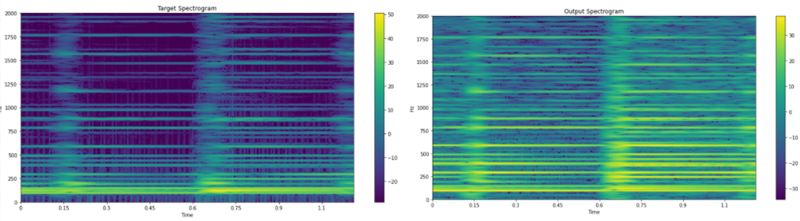

As we can see the two signal are really different one from the other, the target signal is concentrated on the lower frequencies, on the other side the result obtained is uniform around the bandwith btw 0 and 2 kHz.

## **Training**

The training is structured in the following way:

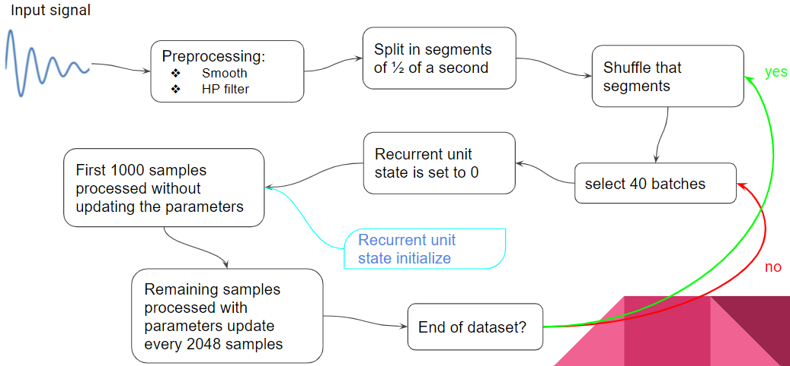

Some result in term of loss:

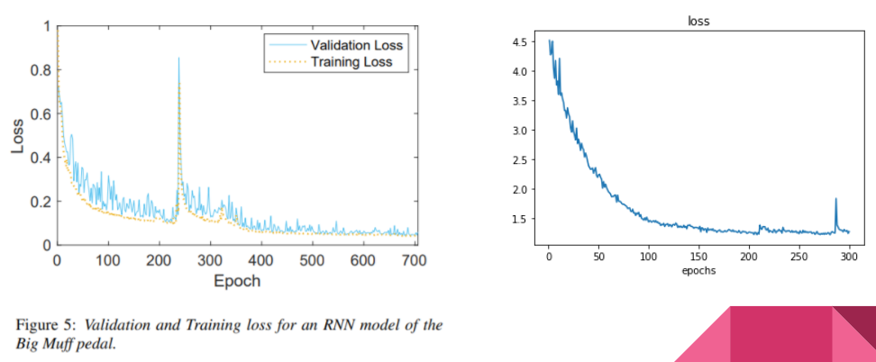

As we can see the result in term of loss show a similar behaviour with the one taken by the reference paper.

## **Problems**

Even if the behaviour resambles the one of the reference paper, the audio results are still pretty bad for the aim we want to achieve. (see presentation 12/11/2021)

We try to high-pass the signal to see if we obtain better results on the output, but the results was worste than before.

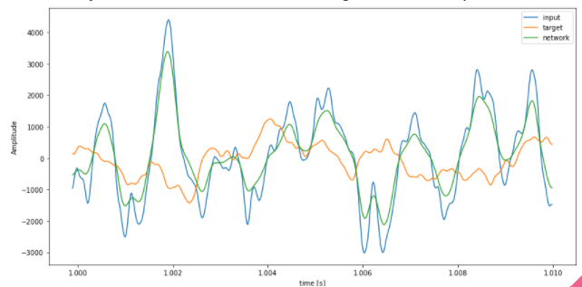

Maybe the network is not learning??

We try to use as a target a signal = 0, and even in this situation the network wasn't able to reproduce the target signal.

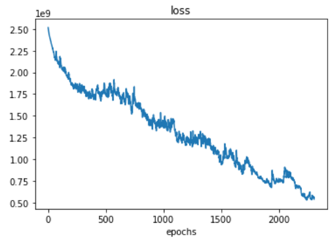

Another problem encountered is the clicking nooise introduced by the network. At each begin of segment we find discontinuities in the signal, so we try to smooth the signal at the end and beginning of each segment, without success.

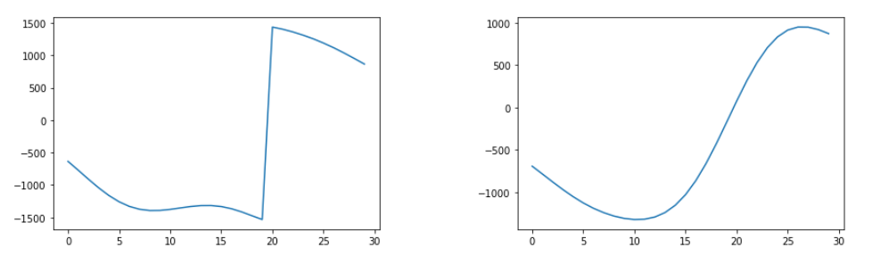

## --> DECEMBER 2021

## *Link of the presentations*

- 01/12/2021 :)
  - <https://docs.google.com/presentation/d/1QdFHdG7W-zAqg1Zd66MaR_yOvuKjdmtIllvIqgUF4is/edit#slide=id.g10511282586_0_0>
- 10/12/2021:
  - <https://docs.google.com/presentation/d/1akIw4xZTCjpMjgMI452rII6IRnHfNfF2naTAs79raf8/edit#slide=id.gf080f14cc4_0_6>
- 17/12/2021:
  - <https://docs.google.com/presentation/d/1XM2_nMeRQAmRTuDLkVVVBy4cXJ0BP9jUslXGGVq0dy8/edit#slide=id.gf080f14cc4_0_6>

## **Done**

- the network learn with tar=0
- have some result on the lower frequencies:)
- study on the output results
- clean the dataset audio
- try new configuration of the model

## ***Dataset***


As we can see we've clean all the dataset audio from the noise of the first samples

## ***Model***

We can observe the old november results, the network wasn't learning:

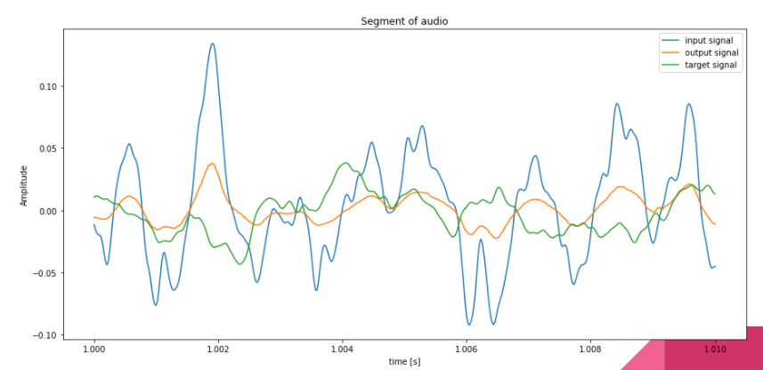

Changing the library used to load the audio from *wave* to *librosa* and adding a butter low pass filter in the pre-processing, finally the network was learning with the target_signal=0:

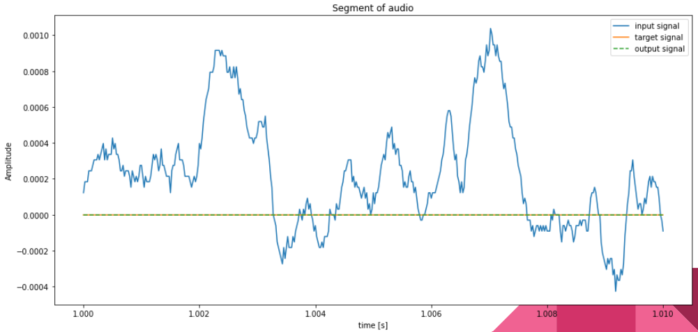

This is the loss function relative to the new model:

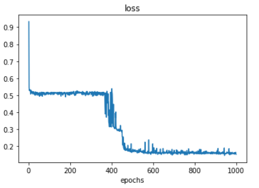

We can appreciate the similarity in the time domain btw the output and the target wrt the previous results:

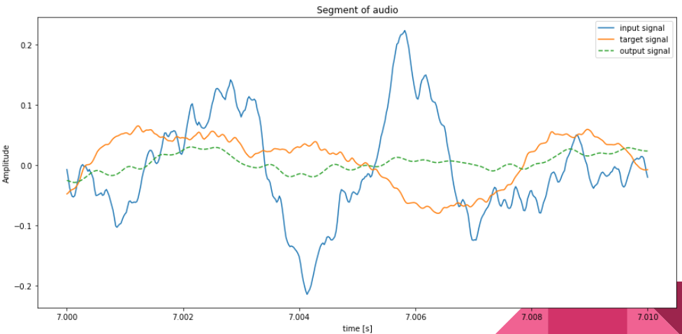

We can here also the audio result in the presentation "01/12/2021"

Also from the spectrogram prospective is appreciatable the similarity in the lower freuqencies btw target and output:

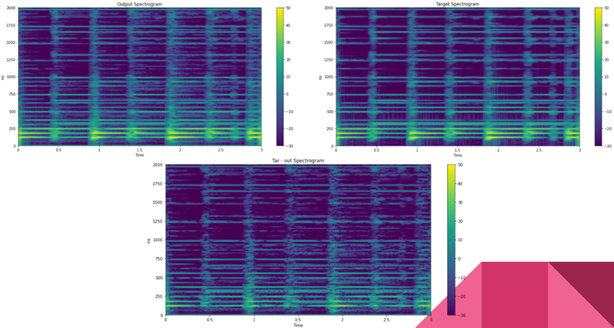

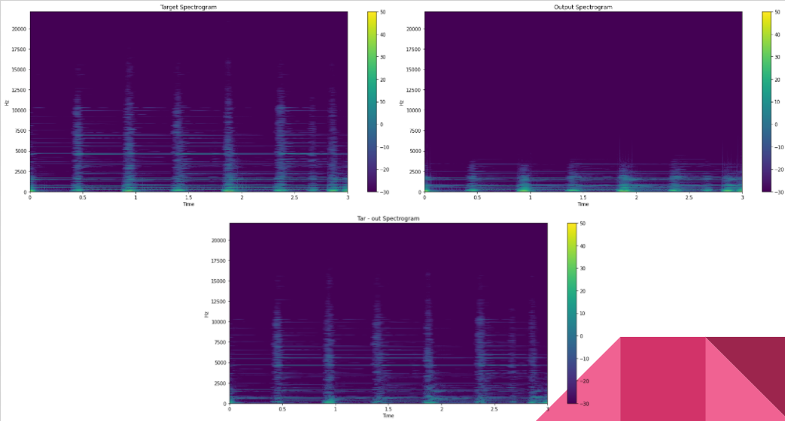

### *Test on the model*

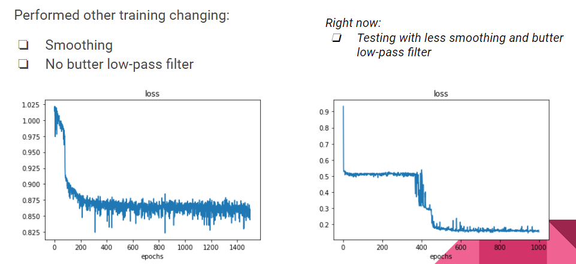

We perform other test on the network to improve the results, in particular on the mid/high frequencies, but it permorms only worste.

## ***Problem***

In addition to the mid/high frequencies problem, it still remains the clicking noise due to the discontinuities btw adjacent segments.

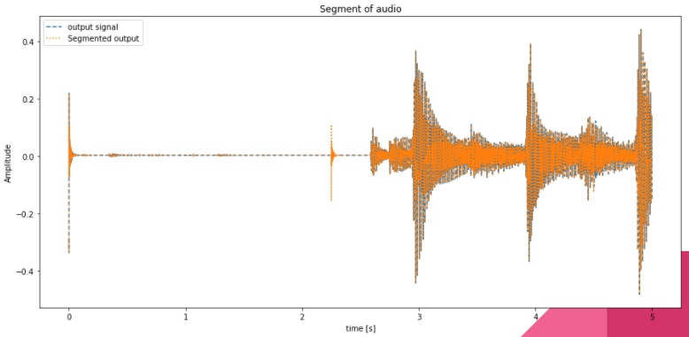

## --> 25/12/2021 --> 10/02/2022 **SESSION**

## --> 11/02/2022

### Link

- <https://docs.google.com/presentation/d/1vO5qUebBdNyvz00WuGkBzI-6N4UX5u3D4L1S2h6gOp4/edit#slide=id.gf080f14cc4_0_653>

## **Done**

- performed other test on different model

## **Problems***

No improvements from the best old model

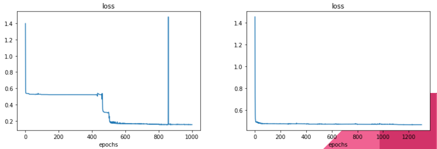

## **Next**

- Study the paper that Sebastian sent me: “Removing distortion effects in music”
- Understand how to have results also for middle and high frequencies  
- Start writing the thesis

## --> 18/02/2022

### Link

- <https://docs.google.com/presentation/d/1cdfVc1SwAqtwtKOmkHJKjvoeT5yyPU30EutVjsFwFj4/edit#slide=id.g101144107f1_0_316>

## **Done**

- Resolve the clicking noise applying a triangular window on the 50% overlapping segments --> the network is able to learn the continuity (still some noise is present)

## **Problem**

Applying the triangular window we resolved the clicking noise, but on the other side the network output results are worst than before:

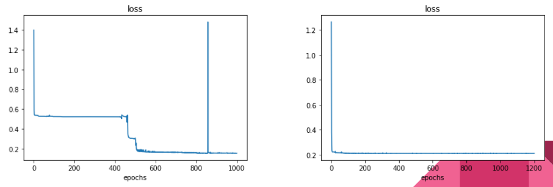

You can also hear the audio results comparison in the presentation 18/02/2022.

## **Next**

- Apply the windowning to the best model try to have the same old results
- Understand how to have results also for middle and high frequencies  
- Start writing the thesis

## --> 25/02/2022

### Link

- <https://docs.google.com/presentation/d/1N2WKQmNoDVFIBe78AvB9QaOeLetJpuB1DfU5O0Fgb2U/edit#slide=id.g101144107f1_0_316>

## **Done**

- apply the windowing to the best model
- have a proper well written code --> implement also the validation and test part of the code

## **Problems**

- Tensorboard problem --> compatibility of the version of pytorch and the other libraries
- The windowing reduce the general amount of energy of the signal and the output is bad
- Maybe the network doesn't suits our task?

## ***Training***

Even applying the triangular windowing of the segments in the best model, the outputs of the various configuration are worste than the old model

You can see the various example in the presentation (25/02/2022)

## **Next**

- Continue to experiment with the new network changing the parameters
- Trying new windowing function rather than triangular :  
  - Raffa: Tuckey window
- Finish reordering the code
- Resolve the tensorboard problem
- Having a draft of the introduction

## --> 04/03/2022

### Link

- <https://docs.google.com/presentation/d/198k-3p-weLbt8FKwim9dOPfUWDxynOPBGULpXZap5zg/edit#slide=id.g101144107f1_0_316>

## **Done**

- Finish reordering the code:
  - main
  - pre-processing
  - general functions
  - network
- Resolving the Tensorboard problem
- Resolving the problems due to the compatibilities of the libraries' version
- Study the spectrogram of the results:
  - Before resolving the clicking noise
  - After resolving the clicking noise

## ***Spectrograms***

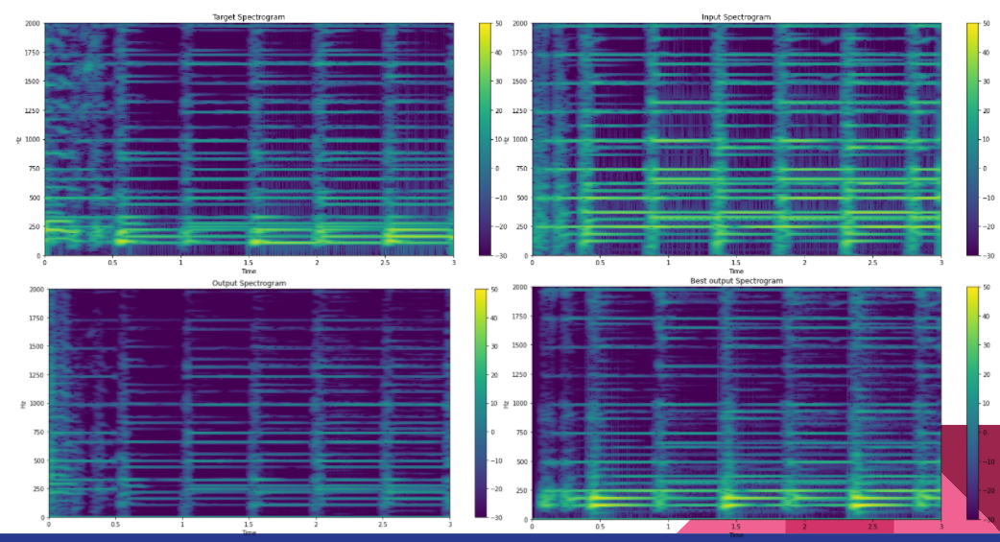

Even on the lower frequencies with the new model the result are bad, also in term of energy, seems that the model is losing energy somewhere.

Here is a comparison on the full bandwidth:

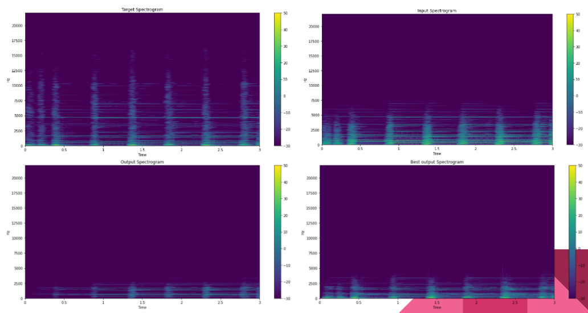

## **Time domain**

Also in the time domain we can see the energy loss in the amplitude of the output signal (WTF is going on!?):

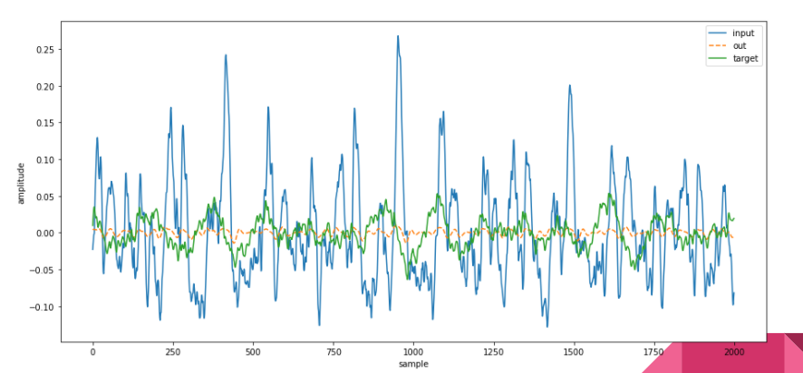

## **Next**

- Restart with the best model and try the Tukey window to remove clicking noise
- Study the paper on removing the distortion effect, maybe a new approach?
- Organize all the data output that I have in a meaningful manner
- Volume problem → try to normalize the input-output
- Having a draft of the introduction

## --> 07/03/2022

## **training performed**

- Try the normalization of the input and output given to the network as:

```{r test-python, engine='python'}
def normalize_audio(audio):
    max = np.max(audio)
    normalized_signal = np.array((audio / np.max(np.abs(audio))) * 32767, np.int16)           # Considering a 16 bit audio 
    return normalized_signal
    
def concatenate_audio(input, AUDIO_DIR, ext): 
  '''Takes in input a list with the name of the audio to concatenate
  and return a single audio with the concatenated audio '''                
  out_in = []
  out_tar = []
  for i in range(len(input)):
    audio_in, fs = librosa.load(AUDIO_DIR + '/' + input[i] + '-' + ext[0] + ".wav", sr=None)
    audio_tar, _ = librosa.load(AUDIO_DIR + '/' + input[i] + '-' + ext[1] + ".wav", sr=None)
    out_in = np.concatenate((out_in,audio_in))
    out_tar = np.concatenate((out_tar,audio_tar))
  out = np.zeros([len(out_in),2])
  out[:,0] = normalize_audio(out_in)
  out[:,1] = normalize_audio(out_tar)
  return out
```

## **Ideas for the next tasks**

### *Short period*

- Try to match the spectrum of the energy between the input and the target
- Understand how much the results change using the low pass filter
- Set the enviroment for the polimi machine --> ask Plosen

### *Long period*

- Try to train on the low frequencies only and on the high frequencies after

## --> 08/03/2022

## Results of the previous day

The results obtained from the last training are really bad, seems more a distortion simulation than an acoustic guitar :(

Here is the audio result:

<https://user-images.githubusercontent.com/55618574/157212559-fe78b37f-e68c-4ce1-98a5-311035dbe9c2.mp4>

And here there is the loss result (in log scale):

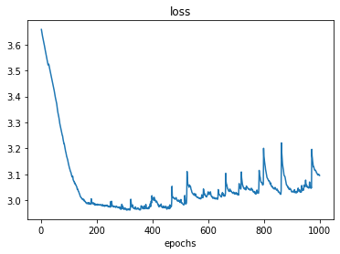

## Done

- Training with normalization btw -1 and 1 of the input and target signal
- Start to update the Logbook with the past progress of the thesis

### *Short period*

- Finish to read and understand the paper "Effect_removal"
- Try to match the spectrum of the energy between the input and the target
- Understand how much the results change using the low pass filter
- Set the enviroment for the polimi machine --> ask Plosen
- Start writing the introduction

### *Long period*

- Try to train on the low frequencies only and on the high frequencies after
- Try to see if the paper "Effect_removal" could have some good implementation for our purpose

## --> 09/03/2022

## **Done**

- new training with normalization
